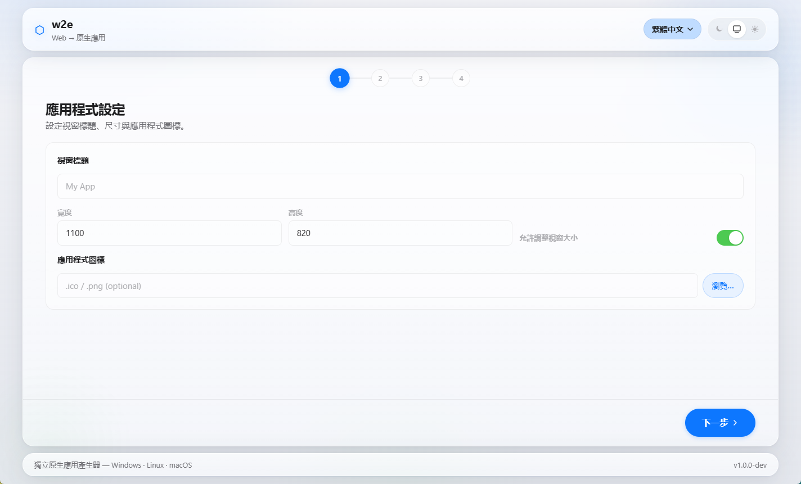

<p align="center">
  <b>🌐 お好みの言語でご覧ください：</b><br>
  <a href="README.md">English</a> · <a href="README.zh-TW.md">繁體中文</a> · <a href="README.zh-CN.md">简体中文</a> · <a href="README.ja.md">日本語</a> · <a href="README.ko.md">한국어</a>
</p>

# w2e — Web → ネイティブ EXE パッケージャ（Windows · Linux · macOS）

w2e は、あらゆる HTML/CSS/JS/SPA Web プロジェクトを Windows、Linux、macOS 上の**スタンドアロンのネイティブ実行ファイル**に変換します——1 つの Web プロジェクトで 3 つのターゲットに対応。生成された各実行ファイルは、システムの Webview（Edge WebView2 / WebKit2GTK / WKWebView）を起動し、内蔵された `127.0.0.1:0` ローカルサーバーに接続します。コンソールウィンドウ、管理者権限/UAC、Node.js/Python ランタイムは不要です。




1 つのコードベースから 2 つの製品を提供：

| 製品 | 機能 |
| --- | --- |
| **w2e Desktop**（`w2e.exe` / `w2e` / `w2e.app`） | Apple / iOS 26「Liquid Glass」ガラス風 GUI。プロジェクトを選択し、ウィンドウ設定を調整して**パッケージ**をクリックするだけで実行ファイルを生成します。 |
| **w2e MCP Server**（`w2e mcp` または `w2e-mcp.exe`） | MCP stdio サーバー。5 つのツールを公開し、AI Agent（Claude Code、Codex、Gemini CLI…）がプログラマティックに検証 / 分析 / ビルド / 環境診断 / バージョン確認を行えます。 |

---

## クイックスタート（Windows ホスト）

```powershell
# w2e をビルド（Go 1.23+ が必要、1.25 ツールチェーンを自動ダウンロード）
# build.ps1 を使用して w2e.exe を GUI サブシステムとしてリンク（DOS ウィンドウなし）：
.\build.ps1
.\build.ps1 -AlsoMcp          # bin\w2e-mcp.exe も同時にビルド

# Web プロジェクトを Windows EXE にパッケージ（モダンマシンで約 6 秒）
.\bin\w2e.exe build .\tests\samples\basic-web --output .\dist\MyApp.exe --title "My App"

# 3 プラットフォームを一度にクロスコンパイル：
.\bin\w2e.exe build .\tests\samples\basic-web --output .\dist\MyApp --target all

# GUI を起動：
.\bin\w2e.exe
```

出力結果：

| ターゲット | ファイル | フォーマット |
| --- | --- | --- |
| `windows` | `MyApp.exe`（`--target all` では `MyApp-windows.exe`）| PE、GUI サブシステム、コンソールウィンドウなし |
| `linux` | `MyApp`（または `MyApp-linux`）| ELF 64-bit |
| `darwin` | `MyApp`（または `MyApp-darwin`）| Mach-O 64-bit |

すべてのターゲットで、エンドユーザーは**プラットフォームの Webview ランタイム**のみインストールすれば OK——Windows の Edge WebView2 Runtime（Windows 11 にバンドル）、Linux の WebKit2GTK（ほとんどのデスクトップディストリビューションに同梱）、macOS の WKWebView（内蔵）。ランタイムに Go ツールチェーンは不要です。

---

## システム要件

| 役割 | 要件 |
| --- | --- |
| **Windows ビルドホスト** | Windows 10/11 x64/ARM64、**Go 1.23+**。Linux/macOS へのクロスコンパイルには対応する C クロスコンパイラが必要です。 |
| **Linux ビルドホスト** | 最新の Linux、**Go 1.23+**、`gcc`、`libwebkit2gtk-4.1-dev`（+ `libgtk-3-dev`）。ネイティブ Linux ビルドのみ。 |
| **macOS ビルドホスト** | macOS 10.13+、**Go 1.23+**、Xcode コマンドラインツール（`clang`）。ネイティブ macOS ビルドのみ。 |
| **エンドユーザー** | プラットフォームの Webview ランタイム（WebView2 / WebKit2GTK / WKWebView）。 |

`w2e doctor` で環境を確認：

```text
w2e doctor — 環境診断

  Windows x64:         ✓
  Go ツールチェーン:    ✓
  WebView2 Runtime:    ✕（未インストール） <-- ランタイムのみ必要
  一時ディレクトリ:    ✓ C:\Users\you\AppData\Local\Temp
  ユーザーデータフォルダ: ✓

ビルドターゲット:
  windows:              ✓ ネイティブ（Go=true / C=true）
  linux:                ✕ クロスコンパイル（Go=true / C=false）
    クロス C コンパイラがありません：対応するツールチェーンをインストールしてください
  darwin:               ✕ クロスコンパイル（Go=true / C=false）
    クロス C コンパイラがありません：対応するツールチェーンをインストールしてください

build_available: true
cross_compile_available: false
```

> **クロスコンパイル。** Windows→Windows は純粋な Go（`CGO_ENABLED=0`）で、Go ツールチェーンのみ必要です。Linux/macOS バイナリのビルドには `CGO_ENABLED=1` とターゲット用の C コンパイラが必要です。ネイティブホストでは Linux は `gcc`、macOS は `clang`（`xcode-select --install` でインストール）を使用します。Windows からのクロスコンパイル：
>
> | ターゲット | C コンパイラ | キット |
> | --- | --- | --- |
> | Windows/macOS から linux/amd64 | `x86_64-linux-gnu-gcc` | `mingw-w64` / Zig ccache / Docker |
> | Linux/Windows から darwin/amd64 | `o64-clang` | `osxcross`（macOS SDK 必要） |
>
> 最も簡単な方法は、各ネイティブホストで `w2e build --target all` を実行することです（CI マトリクス）。Windows の単一 EXE デプロイは純粋な Go のままです。

---

## CLI リファレンス

```text
w2e                      GUI を起動
w2e build SOURCE [flags] Web プロジェクトからネイティブ実行ファイルをビルド
  --entry FILE             エントリー HTML ファイルを上書き（デフォルト：自動検出）
  --name NAME              アプリケーション名（デフォルト：出力ベース名）
  --title TITLE            ウィンドウタイトル（デフォルト："My App"）
  --width N                初期ウィンドウ幅（デフォルト：1024、最小：320）
  --height N               初期ウィンドウ高さ（デフォルト：720、最小：240）
  --icon PATH              アイコンパス（.ico または .png）
  --no-resizable           ウィンドウのリサイズを無効化
  --output PATH            出力パス（必須；--target all でサフィックス追加）
  --keep-temp              失敗時に一時ディレクトリを保持
  --url URL                オンライン URL モード：バイナリがこの URL を直接読み込み
  --target PLATFORM        windows | linux | darwin | all（デフォルト：windows）
w2e validate SOURCE     ビルド前の Web プロジェクト検証
w2e doctor              ローカルビルド環境の診断（クロスターゲット含む）
w2e mcp                 MCP サーバーを起動（stdio トランスポート）
w2e version             バージョン情報を表示
w2e help                ヘルプを表示
```

### オンライン URL モード

`w2e build --url https://...` は、指定された URL をプラットフォームの Webview で直接読み込むバイナリを生成します——ホスト済みアプリをデスクトップランチャーとしてパッケージするのに便利です。

---

## MCP 統合

`w2e mcp`（または専用の `w2e-mcp.exe` バイナリ）は stdio 経由で MCP（Model Context Protocol）を使用します。MCP stdio サーバーをサポートする任意の Agent に接続できます。設定例：

```jsonc
{
  "mcpServers": {
    "w2e": {
      "command": "C:\\path\\to\\bin\\w2e-mcp.exe"
    }
  }
}
```

### 提供ツール

| ツール | 用途 |
| --- | --- |
| `w2e_validate` | パッケージ前の Web プロジェクト検証 |
| `w2e_inspect` | ディレクトリ分析（フレームワーク、エントリー、ファイル数、SPA、警告） |
| `w2e_build` | ローカル Web プロジェクトまたは `source_url` を EXE にビルド |
| `w2e_doctor` | ホストのビルド環境ステータスを報告 |
| `w2e_version` | w2e バージョン情報を報告 |

すべてのレスポンスは JSON 形式です。失敗時は `error_code` と機械可読の `message`、必要に応じて `suggestion` が含まれます。

### セキュリティ

`w2e_build` は Windows システムディレクトリ内（`C:\Windows`、`C:\Program Files`、`C:\Program Files (x86)`、`C:\ProgramData`、`C:\Windows\System32`）の出力パスを**拒否**し、出力パスの相対 `..` トラバーサルも拒否します。ソースディレクトリは、ホストから Agent に付与されたアクセス権限のあるパスに制限されます。

---

## ビルドパイプライン

1. **検証** — エントリー HTML ファイル、CSS、JS の存在を確認し、SPA ルーティング要件を検出。
2. **準備** — 使い捨て Go モジュールを作成（`%TEMP%\w2e\build-XXXX\host`）。
3. **埋め込み** — Web アセットを `host/web/` にコピーし、独立した `main.go` を生成：
   - 埋め込み `//go:embed all:web` FS から提供
   - `127.0.0.1:0` でリッスン（OS 割り当て、`0.0.0.0` は使用しない）
   - ローカルサーバーを指す WebView2 ウィンドウを起動
   - SPA ナビゲーションルートはエントリー HTML にフォールバック
   - `window.open` および外部リンクはシステムのデフォルトブラウザを開く
4. **コンパイル** — `go mod tidy && go build -ldflags "-H windowsgui"` → `app.exe` 生成（コンソールウィンドウなし）
5. **検証** — バイナリモードで EXE を開き、PE ヘッダーを解析してサブシステムが `IMAGE_SUBSYSTEM_WINDOWS_GUI`（2）であることを確認
6. **アイコン** — アイコンが指定されていれば rcedit で適用；それ以外は `w2e-icon.json` にパスを記録
7. **出力** — 検証済み EXE を指定された出力パスにコピー

CLI、MCP、GUI は同じ `builder.Engine` を共有——コードベースにビルドパイプラインは 1 つだけです。

---

## アーキテクチャ

```text
┌─────────────────────────────────────────────────────────┐
│                         w2e.exe                           │
│  ┌────────────┐  ┌────────────┐  ┌─────────────────────┐  │
│  │   CLI      │  │   GUI      │  │   MCP (stdio)        │  │
│  │ (internal/ │  │ (internal/ │  │ (mcp/server.go)      │  │
│  │    cli/    │  │   ui/)     │  │   5 ツール:          │  │
│  │  cmd_*.go) │  │ Liquid-    │  │  w2e_validate,       │  │
│  │            │  │ Glass UI   │  │  w2e_inspect,        │  │
│  │            │  │ 組み込み   │  │  w2e_build,          │  │
│  │            │  │ Web アセット│  │  w2e_doctor,          │  │
│  │            │  └─────┬──────┘  │  w2e_version          │  │
│  └─────┬──────┘        │         └──────────┬──────────┘  │
│        │               │                    │             │
│        └───────────┬───┴────────────────────┘             │
│                    ▼                                      │
│           internal/builder.Engine                       │
│   (検証 → 準備 → 埋め込み → コンパイル → 検証 → 出力)       │
│                    │                                      │
│                    ▼                                      │
│       一時 Go モジュールを生成（main.go + 埋め込み Web 資源）│
│                    │                                      │
│                    ▼                                      │
│               go build -H windowsgui                     │
│                    │                                      │
│                    ▼                                      │
│             ユーザーの app.exe                              │
│      （スタンドアロン、Web プロジェクトを内蔵、              │
│       127.0.0.1:0 で WebView2 を起動）                    │
└─────────────────────────────────────────────────────────────┘
```

---

## 設計原則

- ✅ 純粋な Go、`CGO_ENABLED=0`（GCC / MinGW / Visual Studio 不要）
- ✅ 管理者 / UAC 権限不要
- ✅ ユーザーマシンに Node.js / Python 不要
- ✅ コンソールウィンドウなし（`-H windowsgui`）
- ✅ 固定ポート不使用 — `net.Listen("tcp", "127.0.0.1:0")`
- ✅ `127.0.0.1` のみバインド、`0.0.0.0` は使用しない
- ✅ WebView2 Runtime 検出 + フォールバックメッセージ
- ✅ 完全な多言語対応（zh-TW、zh-CN、en、ja、ko）+ システム言語自動検出
- ✅ CLI / GUI / MCP 共有 BuildEngine
- ✅ すべての GUI アセットを内蔵（起動時にインターネット不要）
- ✅ SPA ルートを `index.html` にフォールバック
- ✅ アプリデータは `%LOCALAPPDATA%` を使用
- ✅ 安定した機械可読エラーコード
- ✅ すべての出力 EXE に PE 検証
- ✅ Apple / iOS 26「Liquid Glass」UI（半透明ガラスぼかし）、ライト / ダーク / 自動テーマ対応
- ✅ アクセシビリティ：キーボードナビゲーション、フォーカスリング、ARIA ロール、モーション削減サポート

---

## プロジェクト構成

```text
cmd/
  w2e/             ← CLI + GUI エントリーポイント
  w2e-mcp/         ← スタンドアロン MCP サーバー
internal/
  builder/         ← 共有 BuildEngine + ホストランタイムテンプレート + PE 検証
  cli/             ← サブコマンドディスパッチ（build/validate/doctor/mcp/gui）
  config/          ← BuildConfig + BuildForm
  errcode/         ← 安定したエラーコード
  i18n/            ← 組み込み JSON ロケール（en、zh-TW、zh-CN、ja、ko）
  inspector/       ← プロジェクト分析
  logging/         ← レベリングログガー → %LOCALAPPDATA%\w2e\logs\
  runtime/         ← WebView2 Runtime レジストリ検出
  ui/              ← Liquid Glass Web UI（組み込みアセット）
  validator/       ← 静的プロジェクト検証
  webserver/       ← MIME テーブル + 静的ファイル + SPA フォールバックサーバー
  webview/         ← WebView2 ウィンドウランチャー
  icon/            ← アイコン変換 + rcedit 適用
mcp/               ← MCP サーバー + ツール + パスセキュリティガード
tests/
  samples/basic-web/ ← エンドツーエンドテスト用サンプルプロジェクト
```

---

## テスト

```powershell
go test ./...
```

ユニットテストでは `sanitizeAppID` と PE 検証、i18n ロケール切替と T() ラウンドトリップ、バリデーター（正常パス、空ディレクトリ、`node_modules` スキップ）、MCP サーバーのパスセキュリティガードをカバーしています。

エンドツーエンドスモークテスト：

```powershell
.\bin\w2e.exe build .\tests\samples\basic-web --output .\dist\Smoke.exe
```

---

## ライセンス

MIT — 詳細は [LICENSE](LICENSE) を参照。
